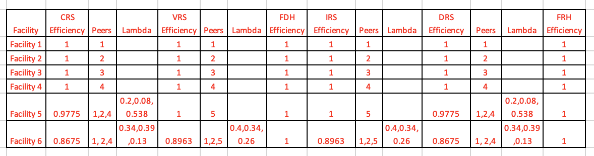

### Project Objective
The purpose of this assignment is to:  
* Explore the use of DEA, formulate and solve DEA problems under different assumptions.  
* Compare and contrast these results  
* Explore goal programming formulations and solutions  

#### Question 1:
The Hope Valley Health Care Association owns and operates six nursing homes in adjoining states. An evaluation of their efficiency has been undertaken using two inputs and two outputs. The inputs are staffing labor (measured in average hours per day) and the cost of supplies (in thousands of dollars per day). The outputs are the number of patient-days reimbursed by third-party sources and the number of patient-days reimbursed privately. A summary of performance data is shown in the table below.  
&nbsp;

DMU           | St Hrs/day | SS/day | Reim Pat-Days | PvtP Pat-Days | 
------------- | -----------| -------| --------------| --------------|
Facility 1    | 150        | 0.2    | 14000         | 3500          |
Facility 2    | 400        | 0.7    | 14000         | 21000         |
Facility 3    | 320        | 1.2    | 42000         | 10500         |
Facility 4    | 520        | 2.0    | 28000         | 42000         |
Facility 5    | 350        | 1.2    | 19000         | 25000         |
Facility 6    | 320        | 0.7    | 14000         | 15000         |  


#### Problem Formulation:

#### DMUs(1,2,3,4,5,6)
```{r}
library(lpSolveAPI)
dmu1 <- read.lp("DMU1.lp")
dmu2 <- read.lp("DMU2.lp")
dmu3 <- read.lp("DMU3.lp")
dmu4 <- read.lp("DMU4.lp")
dmu5 <- read.lp("DMU5.lp")
dmu6 <- read.lp("DMU6.lp")

dmu1
solve(dmu1)
get.objective(dmu1)
get.variables(dmu1)

solve(dmu2)
get.objective(dmu2)
get.variables(dmu2)

solve(dmu3)
get.objective(dmu3)
get.variables(dmu3)

solve(dmu4)
get.objective(dmu4)
get.variables(dmu4)

solve(dmu5)
get.objective(dmu5)
get.variables(dmu5)

solve(dmu6)
get.objective(dmu6)
get.variables(dmu6)
```
We can see from the result above that DMUs 5 and 6 aren't efficient(i.e. the objectives aren't 1). To be specific, DMU5 is at 0.977 and DMU6 is at 0.867. But we can achieve maximum efficiency for DMUs 1,2,3,and 4. This happens when:  
&nbsp;
* For DMU1: weights of 7.142857e-05 and 0 for outputs; 5.172414e-03 and 1.120690e-03 for the two inputs  
* For DMU2: weights of 0 and 4.761905e-05 for outputs; 1.376147e-03 and 6.422018e-04 for the two inputs  
* For DMU3: weights of 2.380952e-05 and 0 for outputs; 1.724138e-03 and 3.735632e-04 for the inputs   
* For DMU4: 0 and 2.380952e-05 for outputs; 6.880734e-04 and 3.211009e-04 for the inputs  
```{r}
#install.packages("Benchmarking")
library(Benchmarking)
```

```{r}
x <- matrix(c(150,400,320,520,350,320,200,700,1200,2000,1200,700),ncol = 2)
y <- matrix(c(14000,14000,42000,28000,19000,14000,3500,21000,10500,42000,25000,15000),ncol = 2)
colnames(y) <- c("ReimbursedPat-Days","PrvtPaidPat-Days")
colnames(x) <- c("StaffHrsPerDay","SuppliesPerDay")
x
y
```
this is just a place holder
```{r}
eff.crs <- dea(x,y,RTS = "crs")  
eff.crs
peers(eff.crs)
lambda(eff.crs)

eff.vrs <- dea(x,y,RTS = "vrs")
eff.vrs 
peers(eff.vrs)
lambda(eff.vrs)

eff.fdh <- dea(x,y,RTS = "fdh")
eff.fdh 
peers(eff.fdh)
lambda(eff.fdh)

eff.irs <- dea(x,y,RTS = "irs")
eff.irs 
peers(eff.irs)
lambda(eff.irs)

eff.drs <- dea(x,y,RTS = "drs")
eff.drs 
peers(eff.drs)
lambda(eff.drs)

eff.frh <- dea(x,y,RTS = "add")
eff.frh 
peers(eff.frh)
lambda(eff.frh)
```


* _Under CRS:_ DMUs 1,2,3,and 4 are 100% efficient. DMU5 is 97.75% efficient, and DMU6 is only 86.75% efficient.
    + The peer units for DMU5 are 1,2,and 4, with relative weights(lambda) of 0.2, 0.08,and 0.538
    + The peer units for DMU6 are 1,2,and 4, with relative weights(lambda) of 0.34, 0.39,and 0.13 

* _Under VRS:_ DMUs 1,2,3,4,5 are 100% efficient. DMU6 is 89.63% efficient.
    + The peer units for DMU6 are 1,2,and 5, with relative weights(lambda) of 0.40, 0.34,and 0.26 

* _Under FDH:_ All DMUs are 100% efficient.

* _Under IRS:_ DMUs 1,2,3,4,5 are 100% efficient. DMU6 is 89.63% efficient.
    + The peer units for DMU6 are 1,2,and 5, with relative weights(lambda) of 0.40, 0.34,and 0.26

* _Under DRS:_ DMUs 1,2,3,and 4 are 100% efficient. DMU5 is 97.75% efficient, and DMU6 is only 86.75% efficient.
    + The peer units for DMU5 are 1,2,and 4, with relative weights(lambda) of 0.2, 0.08,and 0.538
    + The peer units for DMU6 are 1,2,and 4, with relative weights(lambda) of 0.34, 0.39,and 0.13 
* _Under FRH:_ All DMUs are 100% efficient.


### Question 2: 
The Research and Development Division of the Emax Corporation has developed three new products. A decision now needs to be made on which mix of these products should be produced. Management wants primary consideration given to three factors: total profit, stability in the workforce, and achieving an increase in the company’s earnings next year from the $75 million achieved this year. In particular, using the units given in the following table, they want to Maximize Z = P - 6C - 3D, where:  
&nbsp;
* P = total (discounted) profit over the life of the new products,  
* C = change (in either direction) in the current level of employment,  
* D = decrease (if any) in next year’s earnings from the current year’s level.  
&nbsp;

Factor        | P1   | P2   | P3   | Goal     | Units
------------- | -----| -----| -----| ---------| ------
Total Profit  | 20   | 15   | 25   | Maximize | $ Millions 
Facility 2    | 6    | 4    | 5    | = 50     | 100s of employees 
Facility 3    | 8    | 7    | 5    | >= 75    | $ Millions   


#### Part 2.1: Define y1+ and y1-, respectively, as the amount over (if any) and the amount under (if any) the employment level goal. Define y2+ and y2- in the same way for the goal regarding earnings next year. Define x1, x2, and x3 as the production rates of Products 1, 2, and 3, respectively. With these definitions, use the goal programming technique to express y1+, y1- , y2+ and y2- algebraically in terms of x1, x2, and x3. Also express P in terms of x1, x2, and x3.  

20x1 + 15x2 + 25x3 = P ...... This is for the total profit  
 6x1 +  4x2 + 5x3 = 50 ...... This is for workforce stability goal  
 8x1 +  7x2 + 5x3 >= 75 ..... This is for the earnings goal  
 
Introducing auxiliary variables:  
y1 = 6x1 + 4x2 + 5x3 - 50  
y2 = 8x1 + 7x2 + 5x3 - 75   

since:  y1 = (y1P - y1N) and y2 = (y2P - y2N)  

6x1 + 4x2 + 5x3 - (y1P - y1N) = 50  
8x1 + 7x2 + 5x3 - (y2P - y2N) = 75  
P = 20x1 + 15x2 + 25x3  
x1,x2,x3,y1P,y1N,y2P,y2N >= 0  non-negativity constraint  

#### Part 2.2: What is Management's objective function in terms of x1, x2, x3, y1P, y1N, y2P, y2N ?  

Maximize Z = 20x1 + 15x2 + 25x3 - 6 y1P - 6 y1N - 3 y2N  

As employment goal is in both directions, it includes y1P and y1N; Earnings is only if we go under i.e. only y2N.  

#### Part 2.3: Formulate and solve the linear programming model. What are your findings?  
```
/* DMU1: Objective function */

max: 20 x1 + 15 x2 + 25 x3 - 6 y1P - 6 y1N - 3 y2N;

/* Constraints */

6x1 + 4x2 + 5x3 - (y1P - y1N) = 50;
8x1 + 7x2 + 5x3 - (y2P - y2N) = 75;

```
Reading the goal formulation from GP.lp file and assign it to gp
```{r}
gp <- read.lp("GP.lp")
gp

solve(gp)
# the objective value for this problem is:
get.objective(gp)        
# the values of decision variables for the optimal solution are:
get.variables(gp)
```
Z = 225  
x1=0, x2=0, x3=15  
y1P=25, y1N=0, y2N=0, y2P=0  

The employment goal is exceeded by 25 employees and the resulting penalty from exceeding the goal is 225.  

The total (discounted) profit over the life of the new products would be 25*15 = 375 million.  
  


