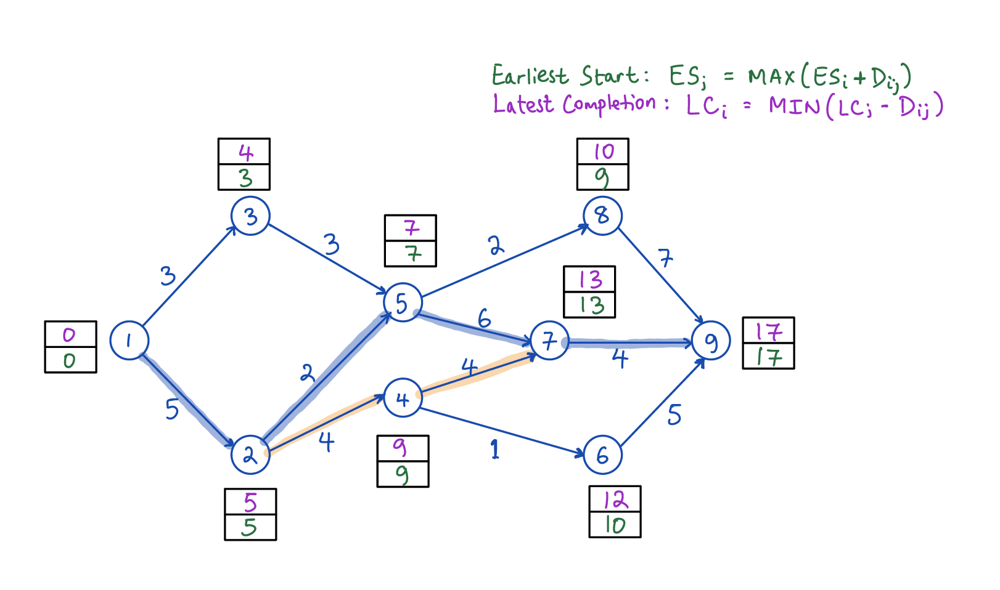

### Project Objective 

The purpose of this assignment is to formulate and solve an Integer Programming problem.

#### Question 1:
Consider the following activity-on-arc project network, where the 12 arcs (arrows) represent the 12 activities (tasks) that must be performed to complete the project and the network displays the order in which the activities need to be performed. The number next to each arc (arrow) is the time required for the corresponding activity. Consider the problem of finding the longest path (the largest total time) through this network from start (node 1) to finish (node 9), since the longest path is the critical path. Formulate and solve the binary integer programming (BIP) model for this problem using library lpsolve or equivalent in R. \  

##### Problem formulation: 
```
/* Objective function */

max: 5 X12 + 3 X13 + 4 X24 + 3 X35 + 2 X25 + X46 + 4 X47 + 6 X57 + 2 X58 + 4 X79 + 7 X89 + 5 X69;

/* Constraints*/

starting node 1: 		    X12 + X13 = 1;
intermediate nodes 2: 	X12 - X24 - X25 = 0;
intermediate nodes 3: 	X13 - X35 = 0;
intermediate nodes 4: 	X24 - X47 - X46 = 0;
intermediate nodes 5: 	X25 + X35 - X57 - X58 = 0;
intermediate nodes 6: 	X47 + X57 - X79 = 0;
intermediate nodes 7: 	X46 - X69 = 0;
intermediate nodes 8: 	X58 - X89 = 0;
finish node 9:    			X69 + X79 + X89 = 1;
non-negativity:		    	Xij >= 0; 
```
```{r}
library(lpSolveAPI)

## create IP object
cpm.ip <- make.lp(nrow = 9, ncol = 12) # nrow is the number of nodes, ncol is the numnber of arcs

# create names for nodes and arcs
arc.names <- c("x12", "x13", "x24", "x35", "x25", "x46", "x47","x57", "x58", "x79", "x89", "x69")
node.names <- c("n1", "n2", "n3", "n4", "n5", "n6","n7","n8","n9")

# rename the IP object
rownames(cpm.ip) <- node.names
colnames(cpm.ip) <- arc.names

## obj function
time <- c(5,3,4,3,2,1,4,6,2,4,7,5)
set.objfn(cpm.ip, -1*time)  # default is min

## set constraints LHS
set.row(cpm.ip, 1, c(1, 1), indices = c(1, 2) )     # n1 (starting node)
set.row(cpm.ip, 2, c(1, -1, -1), indices = c(1, 3, 5))     # n2 (intermediate node)
set.row(cpm.ip, 3, c(1, -1), indices = c(2, 4))  # n3 (intermediate node)
set.row(cpm.ip, 4, c(1, -1, -1), indices = c(3, 6, 7))     # n4 (intermediate node)
set.row(cpm.ip, 5, c(1, 1, -1, -1), indices = c(5, 4, 8, 9))         # n5 (intermediate node)
set.row(cpm.ip, 6, c(1, -1), indices = c(6, 12))  # n6(intermediate node)
set.row(cpm.ip, 7, c(1, 1, -1), indices = c(7, 8, 10))     # n7 (intermediate node)
set.row(cpm.ip, 8, c(1, -1), indices = c(9, 11))  # n6(intermediate node)
set.row(cpm.ip, 9, c(1, 1, 1), indices = c(12, 10, 11))     # n9 (finish node)


## set constraints type
set.constr.type(cpm.ip, rep("="), 9)

## set constraint RHS
rhs <- c(1, rep(0, 7), 1)
set.rhs(cpm.ip, rhs)

## set all variables type to be binary
set.type(cpm.ip, 1:12, "binary")

## solve the IP problem
solve(cpm.ip)
get.objective(cpm.ip)
get.variables(cpm.ip)

# put optimal values beside of variable names for better understanding of th results
cbind(arc.names, get.variables(cpm.ip))

```
##### We can see from the resut that the critical pat is: n1 -> n2 -> n5 -> n7 -> n9, and a duration of 17 time units. Solving the critical path problem manually will yield the same result as well. It is indicated below. \  
&nbsp;



#### Question 2: Selecting an Investment Portfolio An investment manager wants to determine an opti- mal portfolio for a wealthy client. The fund has $2.5 million to invest, and its objective is to maximize total dollar return from both growth and dividends over the course of the coming year. The client has researched eight high-tech companies and wants the portfolio to consist of shares in these firms only. Three of the firms (S1 – S3) are primarily software companies, three (H1–H3) are primarily hardware companies, and two (C1–C2) are internet consulting companies. The client has stipulated that no more than 40 percent of the investment be allocated to any one of these three sectors. To assure diversification, at least $100,000 must be invested in each of the eight stocks. Moreover, the number of shares invested in any stock must be a multiple of 1000. 

##### Problem formulation: 
```
/* Objective function 

Here we're maximizing the dollar return of both growth and dividends.
As a result, the coefficients will be calculated as follows:
For S1, it will be ((0.05 * $40) + $2.00) = 4.
We'll compute the same for the S2,S3,H1,H2,H3,C1,C2

*/

max: 4 S1 + 6.5 S2 + 5.9 S3 + 5.4 H1 + 5.15 H2 + 10 H3 + 8.4 C1 + 6.25 C2; 


/* Constraints */

40 S1 + 50 S2 + 80 S3 + 60 H1 + 45 H2 + 60 H3 + 30 C1 + 25 C2 <= 2500000;
40 S1 + 50 S2 + 80 S3 <= 1000000;
60 H1 + 45 H2 + 60 H3 <= 1000000;
	 30 C1 + 25 C2 <= 1000000;
	 40 S1 >= 100000;
	 50 S2 >= 100000;
	 80 S3 >= 100000;
	 60 H1 >= 100000;
	 45 H2 >= 100000;
	 60 H3 >= 100000;
	 30 C1 >= 100000;
	 25 C2 >= 100000;
	 /* this is to fulfill the multiple of a 1000 constraint */
	 S1 = 1000 N1;
	 S2 = 1000 N2;
	 S3 = 1000 N3;
	 H1 = 1000 N4;
	 H2 = 1000 N5;
	 H3 = 1000 N6;
	 C1 = 1000 N7;
	 C2 = 1000 N8;
/* integer restrictions */
int S1, S2, S3, H1, H2, H3, C1, C2;
int N1, N2, N3, N4, N5, N6, N7, N8;
```

Reading the integer restricted investment problem from invest_int.lp file and assign it to invest variable
```{r}
library(lpSolveAPI)

invest <- read.lp("invest_int.lp")
invest

solve(invest)
# the objective value for this problem is:
get.objective(invest)        
# the values of decision variables for the optimal solution are:
get.variables(invest)
```
#### Question 2.1: Determine the maximum return on the portfolio. What is the optimal number of shares to buy for each of the stocks? What is the corresponding dollar amount invested in each stock? \  

##### The maximum return for the portfolio is $567,900. \  
##### Optimal amount of shares to buy for each of the stocks is: \  
* S1: 3000, S2: 2000, S3: 2000, H1: 2000, H2: 3000, H3: 2000, C1:54000, C2: 5000  \  

##### The corresponding dollar amount invested in each stock is: \  
* S1: 3000 @ $40 = 120,000
* S2: 4000 @ $50 = 200,000
* S3: 2000 @ $80 = 160,000
* H1: 2000 @ $60 = 120,000
* H2: 3000 @ $45 = 135,000
* H3: 12000 @ $60 = 720,000
* C1: 30000 @ $30 = 900,000
* C2: 4000 @ $25 = 100,000

#### Question 2.2: Compare the solution in which there is no integer restriction on the number of shares invested. By how much (in percentage terms) do the integer restrictions alter the value of the optimal objective function? By how much (in percentage terms) do they alter the optimal investment quantities? \  
* There is a difference of optimal objective function is: ((477,050 - 473,050) / 477,050)*100% = 0.83%  \  
* The only optimal investment quantity that changed is S1. \  
* Calculated as ((4000-3000)/4000)*100% = 25% \  

```{r}
library(lpSolveAPI)

invest0 <- read.lp("invest_1.lp")
invest0

solve(invest0)
# the objective value for this problem is:
get.objective(invest0)        
# the values of decision variables for the optimal solution are:
get.variables(invest0)
```